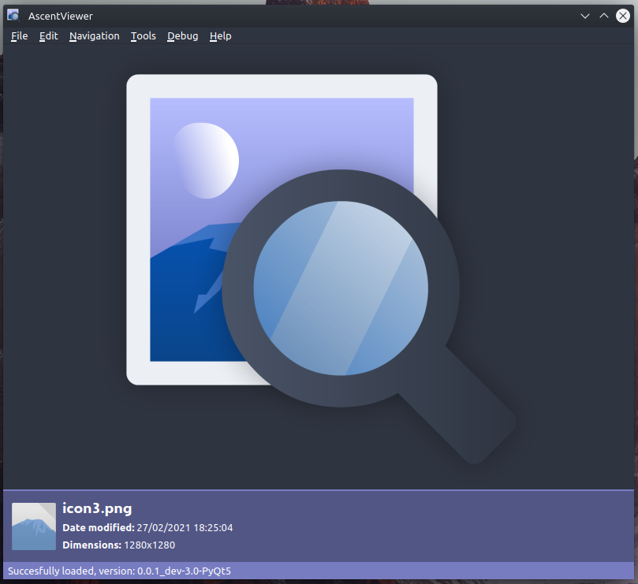
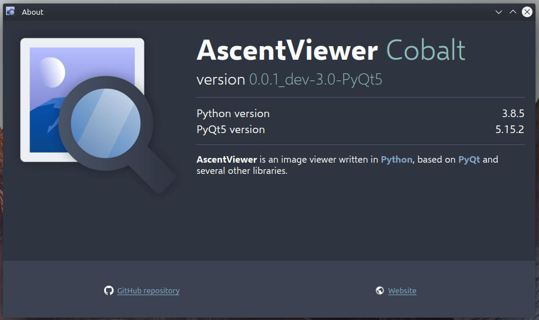

# AscentViewer

**AscentViewer** is an image viewer written in [Python](https://www.python.org/) based on [PyQt](https://riverbankcomputing.com/software/pyqt/) and [several other libraries.](CREDITS.md)

Here is [its website](https://dd.acrazytown.com/AscentViewer/).

---

<!-- NOTE: Add notice about statistics. -->

## What happened to DDIV?

DDIV got renamed to **AscentViewer**.

The main reason for that is that the owner of the program, [DespawnedDiamond](https://github.com/despawnedd), is not the only one working on it anymore (DDIV was short for ***DespawnedDiamond's*** *Image Viewer*"), and the second reason is that "AscentViewer" just sounds better.

Looking for old, pre-rename/Old Pre-release Beta code? Check out the ["pre-rename" branch.](https://github.com/despawnedd/AscentViewer/tree/pre-rename)

---

## Screenshots

> *AscentViewer's main window*

> *AscentViewer's about window*

## How to run/install

### A quick tl;dr

Install Python 3.7 or higher, install the required `pip` packages for AscentViewer, and then run AscentViewer.

### Detailed instructions

#### Windows

**Note**: Keep in mind that `py` requires the Python launcher to be installed. If you didn't install the launcher, you'll have to replace `py` with the direct path to the Python executable, or `python` (read the note below).

**Note 2**: If you've added the Python 3 executable to PATH (either by selecting [this](misc/markdown/img/add_to_path_win.png) when installing it from the official installer, or manually), you can run `python` instead of `py`, and `pip` or `python -m pip` instead of `py -m pip`.

* Install Python 3.7 or higher from [here](https://www.python.org/downloads/).
* Run `py -m pip install -r <path to requirements.txt>` to install the required pip packages.
* Run `py <path to src/AscentViewer directory>`, or the [launcher script](src/Launch_AscentViewer.bat), or the [\_\_main\_\_.py]("src/AscentViewer/__main__.py") script.

#### macOS

* Install Python 3.7 or higher, either by building it from source, or by installing it with a package manager like [Homebrew](https://brew.sh). Or you could simply just install it from [Python's official website](https://python.org/downloads/).
* Because AscentViewer relies on a few non built-in libraries, we need to install them. You can do this manually or by running `python3 -m pip install -r <path to requirements.txt>` (This command may differ depending on if Python has been added to PATH or not).
  * **NOTE: When installing the requirements, make sure to not call `python` instead of `python3` on accident. On macOS, `python` is an old version of Python that doesn't work with AscentViewer.**
* Run `python3 <path to src/AscentViewer directory>`, or just run the [\_\_main\_\_.py]("src/AscentViewer/__main__.py") script, either by opening it in Finder (if you installed the Python launcher), or by running it from the terminal. Maybe the [bash launcher script](src/Launch_AscentViewer.sh) works too?

#### Linux

**Note**: If Python 3's not in PATH after you installed it, when running the commands mentioned in the 3rd and 4th point, replace `python3` with the direct path to Python 3 (unless you have an alias for that). Or, you could just add it to PATH.

* Install Python 3.7 or higher. The recommended way to do so is by installing it using a package manager, such as `apt` (`apt install python3`). Note: using a package manager might require administrator access (which can be granted with `sudo` or something similar).
* You might also have to install `qt5-default` (for apt, the command is `apt install qt5-default`).
* Run `python3 -m pip install -r <path to requirements.txt>` if Python is in PATH (or just `pip` instead of `python3 -m pip`) to install the required pip packages.
* Run `python3 <path to src/AscentViewer directory>`, or the [launcher script](src/Launch_AscentViewer.sh), or the [\_\_main\_\_.py]("src/AscentViewer/__main__.py") script.

## Credits

You can read the credits [here](CREDITS.md) (unfinished).

## Documentation

You can read the documentation [here](https://github.com/despawnedd/AscentViewer/wiki) (unfinished).

## Release version naming info

Each version name consists of four elements:

* major version number
* minor version number
* revision number
* additional info (such as the branch, the pre-release version number, etc.)

e.g. **1.0.3_dev-1.3**
